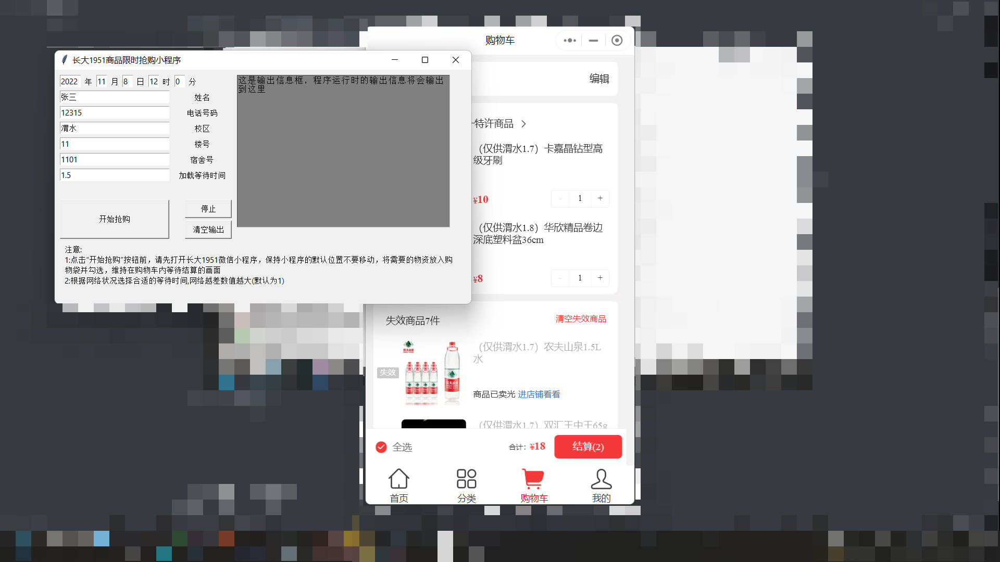
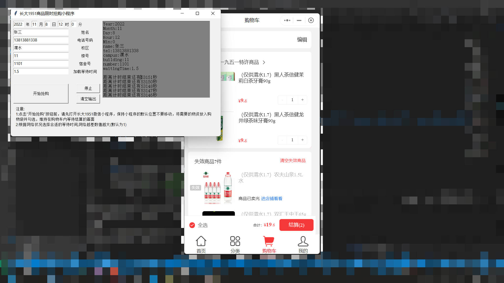
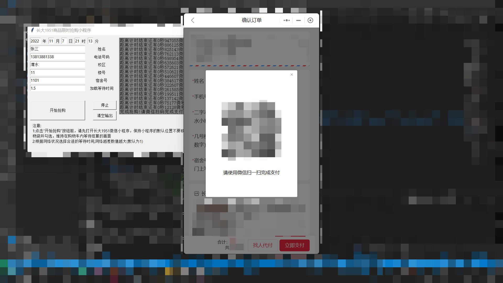

# CHD_1951_WechatApp_Buy

[English]: ./README_en.md

长大1951小程序抢购

## 简介

利用python的pyautogui自动抢购微信小程序长大1951商城里的商品，gui部分用的时tkinker

由于目前手边只有1080p屏幕的电脑，此程序仅兼容屏幕分辨率为1080*1920的电脑。

## 使用方法

- 首先通过微信电脑版打开长大1951小程序并保持初始位置不变

- 将需要的商品加入购物车并选中至等待结算状态

  

- 打开我们的软件并将参数设定好

  

- 确定无误后点击“开始抢购”

  

- 时间到后扫描二维码支付

  

- 可以根据网速和服务器的速度适当调整加载等待时间

## 之后的想法

首先，现在软件的gui用的是tkinker，因为一开始没有怎么规划，gui部分的代码有点乱，打算以后优化整合一下。

目前的软件功能有点像之前接触过的一些键盘精灵之类的软件，以后想加个键盘录制的功能，增加适配性。

## 请我喝杯奶茶？

稍后补个二维码
